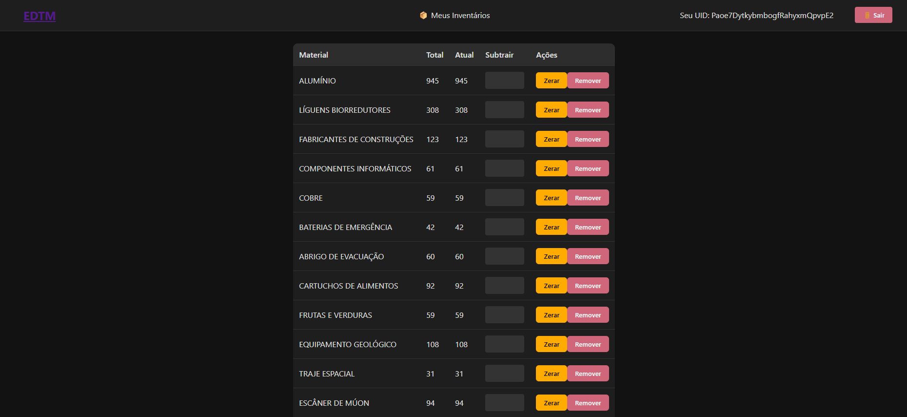
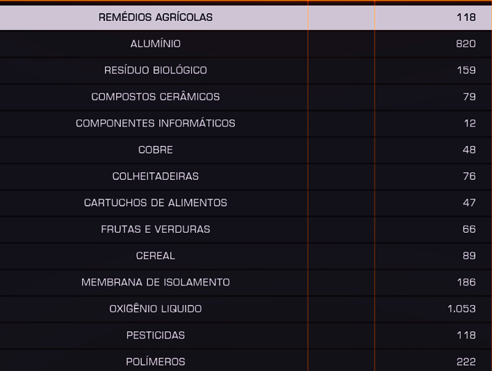

# EDMC - Sistema de Gerenciamento de Inventários

[](https://opensource.org/licenses/MIT)

Sistema para gerenciamento de inventários colaborativos com integração Firebase.

 <!-- Adicione uma imagem real posteriormente -->

## 🚀 Como Usar

### 1. Acessar o Sistema

- URL: [https://gabrielmazzuchello.github.io/edmc](https://gabrielmazzuchello.github.io/edmc)
- Faça login com e-mail/senha ou crie uma nova conta

### 2. Carregar Inventário

1. Clique em **"Novo Inventário"**
2. Selecione um arquivo:
   - **Formato Excel**: `.xlsx` com colunas:
     ```plaintext
     | Materiais         | Valor |
     |-------------------|-------|
     | Alumínio          | 945   |
     | Componentes Eletrônicos | 61    |
     ```
   - **Formato JSON**:
     ```json
     {
       "Alumínio": 945,
       "Componentes Eletrônicos": 61
     }
     ```
3. OBS: para criar esses arquivos voce tirará prints da sua tela do jogo
   - EX: 
   - E enviará para o [DeepSeek](https://www.deepseek.com) ou [ChatGPT](https://chatgpt.com)
   - Com a sequinte mensagem:
     `crie uma lista desses materiais e transforme em json onde o nome será a chave`
   - Ele irá retornar um 'codigo' copiavel, abra o bloco de notas e cole-o e logo depois salve-o com a estensão .json OBS: o nome do arquivo será o nome da tabela no site
   - 

### 3. Gerenciar Inventários
- **Em 'Meus Inventários'**
- **Visualizar**: Clique em qualquer card para abrir
- **Editar**: Atualize valores diretamente na tabela
- **Excluir**:
  1. Apenas o dono verá o botão 🗑️
  2. Confirme a exclusão

### 4. Adicionar Colaboradores

1. Acesse um inventário
2. No final da tabela, cole o **UID** do colaborador:
   ```plaintext
   Exemplo: RqUqIjrFzKOEAC0KzAvF67jGd2G3
   ```
